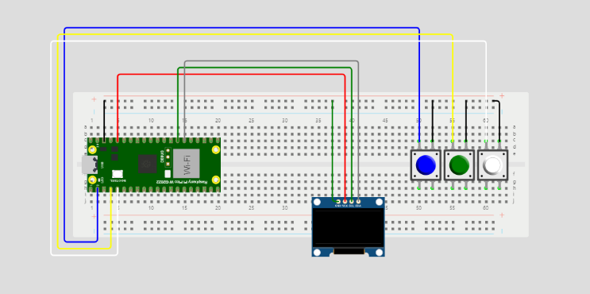
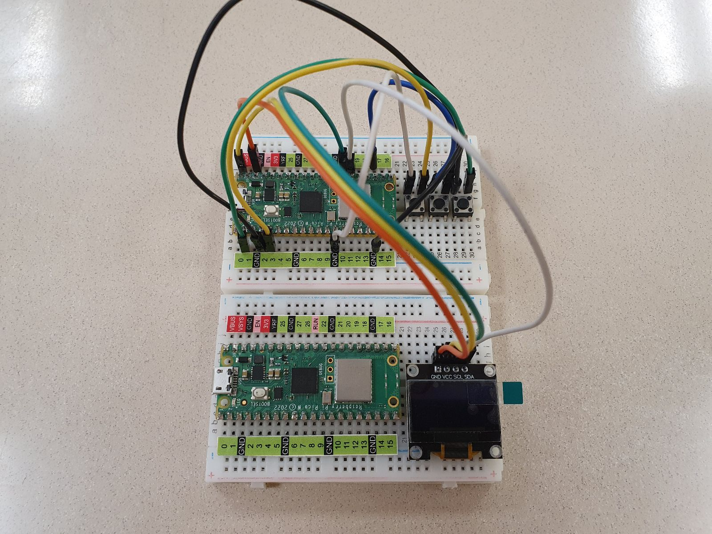
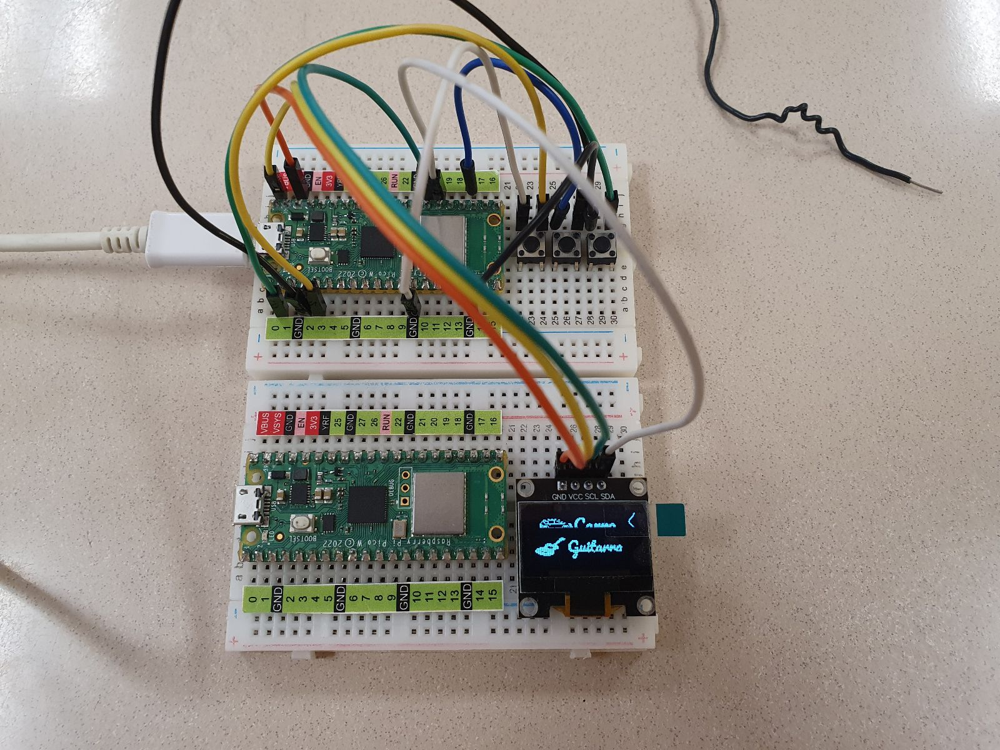
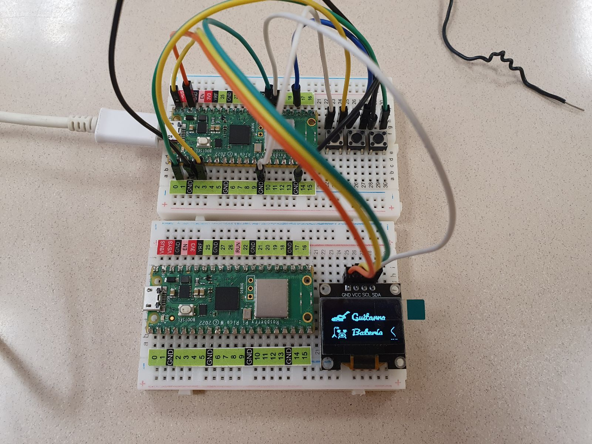
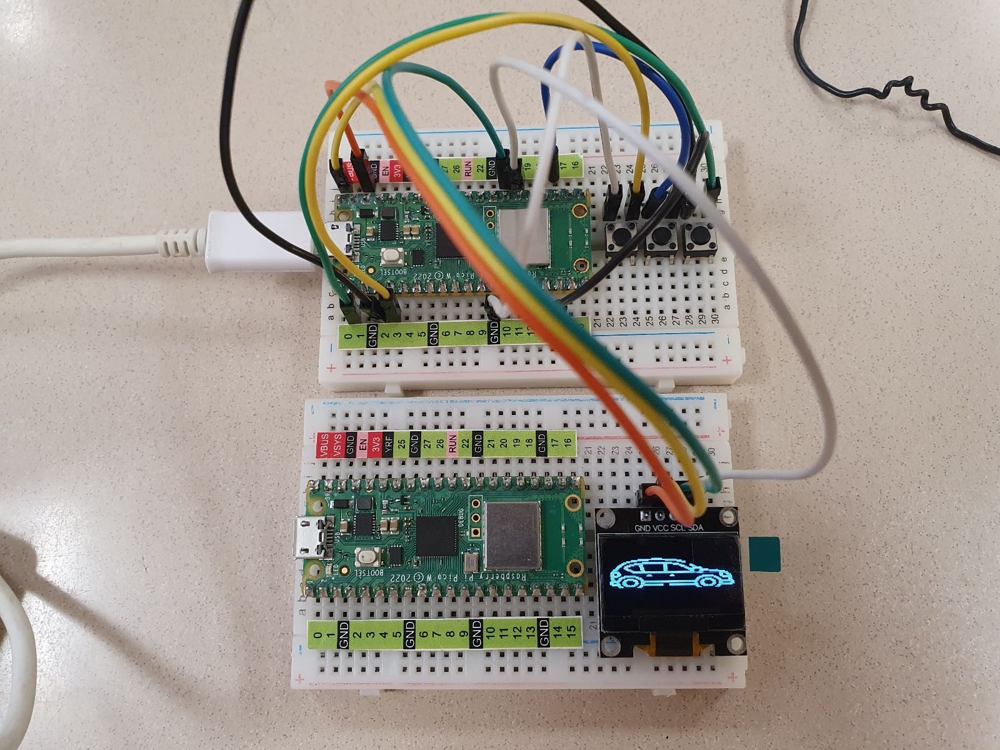
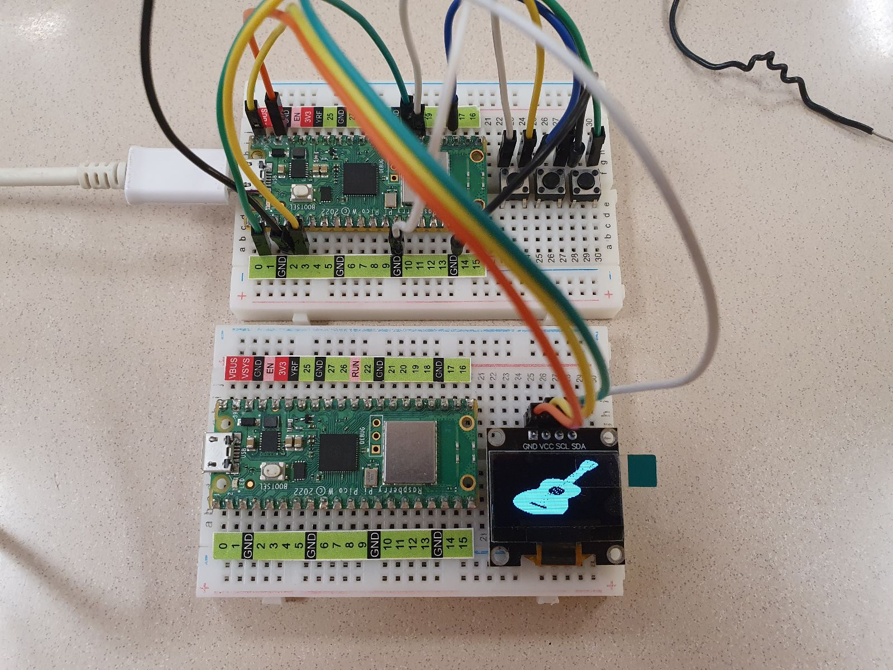
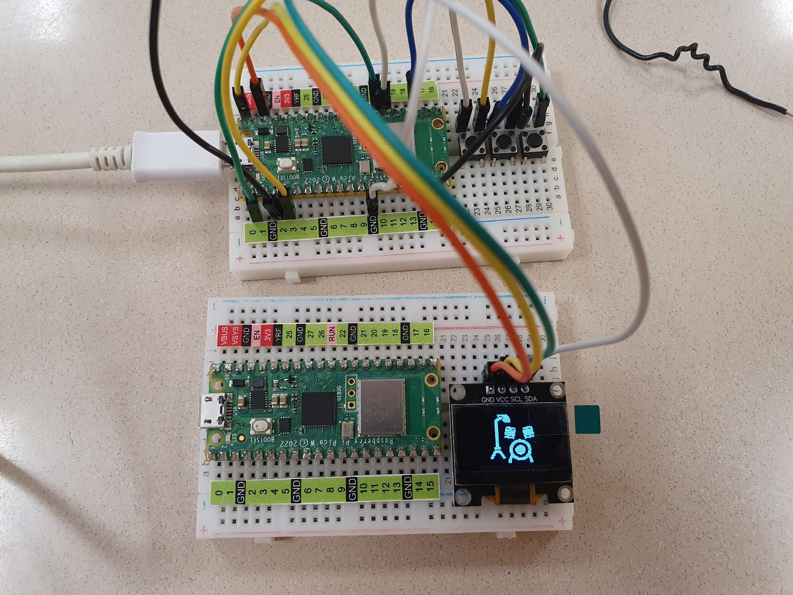

# Práctica-2.3

# 2.3 Elabore un menú en OLED Display (MENU DE NAVEGACION) y TIPOS LETRA Personalizadas
Depto de Sistemas y Computación  
Ing. En Sistemas Computacionales  
SISTEMAS PROGRAMABLES 23a  
Autor: Jesús Elías Martínez  
Fecha de entrega:   19/10/2023  
Objetivo: Manipular los estados de los PushButton en un menú de 3 opciones desplegados en la pantalla OLED

**Modelado en wokwi**  
  

**Conexiones (en físico)**  
 

**Código de thonny**   
Lenguaje: Phyton
```
#Elías Martínez Jesús      No. control: 20211768

#Importar librerías
import framebuf
from utime import sleep
#Importar elementos de biblioteca
from machine import Pin, I2C 
from ssd1306 import SSD1306_I2C

Menu = True #Iniciar el menú
Seleccion = 1 #Flecha de selección en opción 1

#Bytearray de la flehca que muestra que opción seleccionarás
SelecOPC = bytearray([0x00, 0x00, 0x00, 0x80, 0x01, 0x80, 0x01, 0x00, 0x03, 0x00, 0x06, 0x00, 0x0c, 0x00, 0x18, 0x00, 
0x30, 0x00, 0x20, 0x00, 0x60, 0x00, 0x20, 0x00, 0x30, 0x00, 0x18, 0x00, 0x0c, 0x00, 0x06, 0x00, 
0x03, 0x00, 0x01, 0x00, 0x00, 0x80, 0x00, 0x80, 0x00, 0x00
])

#Bytearray de las 3 opciones del menú
CarroOp = bytearray([0x00, 0x00, 0x00, 0x00, 0x00, 0x00, 0x00, 0x00, 0x00, 0x00, 0x00, 0x00, 0x00, 0x00, 0x00, 0x00, 
0x00, 0x00, 0x00, 0x00, 0x00, 0x00, 0x00, 0x00, 0x00, 0x00, 0x00, 0x00, 0x00, 0x00, 0x00, 0x00, 
0x00, 0x00, 0x00, 0x00, 0x00, 0x00, 0x00, 0x00, 0x00, 0x00, 0x00, 0x00, 0x00, 0x00, 0x00, 0x00, 
0x00, 0x00, 0x00, 0x00, 0x00, 0x00, 0x00, 0x00, 0x00, 0x00, 0x00, 0x00, 0x00, 0x00, 0x00, 0x00, 
0x00, 0x00, 0x00, 0x00, 0x00, 0x00, 0x00, 0x00, 0x00, 0x00, 0x00, 0x00, 0x00, 0x00, 0x00, 0x00, 
0x00, 0x00, 0x00, 0x00, 0x03, 0xf0, 0x00, 0x00, 0x00, 0x00, 0x00, 0x00, 0x00, 0x19, 0x98, 0x00, 
0x00, 0x0f, 0xf8, 0x00, 0x00, 0x00, 0x00, 0x00, 0x00, 0x03, 0x8f, 0xf1, 0x80, 0x00, 0x1e, 0x38, 
0x00, 0x00, 0x00, 0x00, 0x00, 0x00, 0x06, 0xf0, 0x26, 0x00, 0x00, 0x3c, 0x38, 0x00, 0x00, 0x00, 
0x00, 0x00, 0x00, 0x0b, 0x10, 0x21, 0xb0, 0x00, 0x38, 0x38, 0x00, 0x00, 0x00, 0x00, 0x00, 0x00, 
0x11, 0x10, 0x20, 0x66, 0x00, 0x78, 0x10, 0x00, 0x00, 0x00, 0x00, 0x00, 0x00, 0x30, 0xff, 0xff, 
0xfc, 0x38, 0x70, 0x00, 0x60, 0xcc, 0xcc, 0x38, 0x00, 0x00, 0x38, 0x04, 0x00, 0x00, 0x1c, 0x70, 
0x01, 0xf9, 0xfd, 0xde, 0xfc, 0x00, 0x00, 0x3f, 0xe0, 0x00, 0x0f, 0xdc, 0x70, 0x03, 0xf9, 0xfd, 
0xfe, 0xfe, 0x00, 0x00, 0x3b, 0xd0, 0x00, 0x17, 0xae, 0x70, 0x03, 0xb9, 0xff, 0xff, 0xce, 0x00, 
0x00, 0x3e, 0x5f, 0xdf, 0xf4, 0xbe, 0x78, 0x07, 0x3b, 0xff, 0xef, 0xce, 0x00, 0x00, 0x3e, 0xdf, 
0xdf, 0xf6, 0xbc, 0x3c, 0x07, 0x33, 0xcf, 0xcf, 0xce, 0x00, 0x00, 0x07, 0xe0, 0x00, 0x0f, 0xc0, 
0x1f, 0xff, 0xff, 0xc1, 0xc1, 0xfc, 0x00, 0x00, 0x00, 0x00, 0x00, 0x00, 0x00, 0x0f, 0xff, 0xff, 
0x81, 0xc0, 0xf8, 0x00, 0x00, 0x00, 0x00, 0x00, 0x00, 0x00, 0x01, 0x80, 0x00, 0x00, 0x00, 0x00, 
0x00, 0x00, 0x00, 0x00, 0x00, 0x00, 0x00, 0x00, 0x00, 0x00, 0x00, 0x00, 0x00, 0x00, 0x00, 0x00, 
0x00, 0x00, 0x00, 0x00, 0x00, 0x00, 0x00, 0x00, 0x00, 0x00, 0x00, 0x00, 0x00, 0x00, 0x00, 0x00, 
0x00, 0x00, 0x00, 0x00, 0x00, 0x00, 0x00, 0x00, 0x00, 0x00, 0x00, 0x00, 0x00, 0x00, 0x00, 0x00, 
0x00, 0x00, 0x00, 0x00, 0x00, 0x00, 0x00, 0x00, 0x00, 0x00, 0x00, 0x00, 0x00, 0x00, 0x00, 0x00, 
0x00, 0x00])

GuitarraOp = bytearray([0x00, 0x00, 0x00, 0x00, 0x00, 0x00, 0x00, 0x00, 0x00, 0x00, 0x00, 0x00, 0x00, 0x00, 0x00, 0x00, 
0x00, 0x00, 0x00, 0x00, 0x00, 0x00, 0x00, 0x00, 0x00, 0x00, 0x00, 0x00, 0x00, 0x00, 0x70, 0x00, 
0x00, 0x00, 0x00, 0x00, 0x00, 0x00, 0x00, 0x00, 0x00, 0x00, 0x01, 0xfc, 0x00, 0x00, 0x00, 0x00, 
0x00, 0x00, 0x00, 0x00, 0x00, 0x00, 0x00, 0x01, 0xf8, 0x00, 0x00, 0x00, 0x00, 0x00, 0x00, 0x00, 
0x00, 0x00, 0x00, 0x00, 0x07, 0xc0, 0x07, 0xe0, 0x00, 0x0f, 0x00, 0x00, 0x00, 0x00, 0x00, 0x00, 
0x00, 0x0f, 0x00, 0x0f, 0xf0, 0x00, 0x0f, 0x00, 0x00, 0x00, 0x00, 0x00, 0x00, 0x00, 0x1e, 0x00, 
0x1c, 0x70, 0x01, 0x9b, 0x00, 0x00, 0x00, 0x00, 0x00, 0x00, 0x7c, 0x78, 0x00, 0x38, 0x30, 0x03, 
0x9e, 0x00, 0x00, 0x00, 0x00, 0x00, 0x01, 0xff, 0xf0, 0x00, 0x70, 0x30, 0x03, 0xbe, 0x00, 0x00, 
0x00, 0x00, 0x00, 0x01, 0xff, 0xf8, 0x00, 0x70, 0x01, 0x11, 0x7f, 0x10, 0x4c, 0x88, 0x60, 0x00, 
0x03, 0xc5, 0xfc, 0x00, 0x70, 0x03, 0xb3, 0xff, 0x7c, 0xdd, 0xfd, 0xf0, 0x00, 0x7f, 0xc0, 0xfc, 
0x00, 0x70, 0xf3, 0x33, 0x30, 0xfc, 0xfd, 0xf9, 0xf8, 0x03, 0xff, 0xf5, 0xfc, 0x00, 0x70, 0xf3, 
0x77, 0x30, 0xcd, 0xff, 0xff, 0xb0, 0x07, 0xff, 0xff, 0xe0, 0x00, 0x78, 0x37, 0x77, 0x71, 0xdd, 
0xef, 0xdf, 0x30, 0x0f, 0xff, 0xff, 0x80, 0x00, 0x3f, 0xff, 0xff, 0xf9, 0xdf, 0xc7, 0x8f, 0x70, 
0x0f, 0xe7, 0xff, 0x80, 0x00, 0x1f, 0xff, 0xff, 0xdf, 0xff, 0xc1, 0x83, 0xf0, 0x07, 0xfc, 0x7f, 
0x80, 0x00, 0x03, 0xf0, 0x01, 0x04, 0x04, 0x80, 0x00, 0x00, 0x01, 0xff, 0xff, 0x80, 0x00, 0x00, 
0xe0, 0x00, 0x00, 0x00, 0x00, 0x00, 0x00, 0x00, 0x7f, 0xff, 0x00, 0x00, 0x01, 0xe0, 0x00, 0x00, 
0x00, 0x00, 0x00, 0x00, 0x00, 0x07, 0xf8, 0x00, 0x00, 0x03, 0x60, 0x00, 0x00, 0x00, 0x00, 0x00, 
0x00, 0x00, 0x00, 0x00, 0x00, 0x00, 0x06, 0xc0, 0x00, 0x00, 0x00, 0x00, 0x00, 0x00, 0x00, 0x00, 
0x00, 0x00, 0x00, 0x07, 0xc0, 0x00, 0x00, 0x00, 0x00, 0x00, 0x00, 0x00, 0x00, 0x00, 0x00, 0x00, 
0x03, 0x80, 0x00, 0x00, 0x00, 0x00, 0x00, 0x00, 0x00, 0x00, 0x00, 0x00, 0x00, 0x00, 0x00, 0x00, 
0x00, 0x00, 0x00, 0x00, 0x00, 0x00, 0x00, 0x00, 0x00, 0x00, 0x00, 0x00, 0x00, 0x00, 0x00, 0x00, 
0x00, 0x00])

BateriaOp = bytearray([0x00, 0x00, 0x00, 0x00, 0x00, 0x00, 0x00, 0x00, 0x00, 0x00, 0x00, 0x00, 0x00, 0x00, 0x00, 0x00, 
0x00, 0x00, 0x00, 0x00, 0x00, 0x00, 0x00, 0x00, 0x00, 0x00, 0x00, 0x7c, 0x00, 0x00, 0x00, 0x00, 
0x00, 0x00, 0x00, 0x00, 0x00, 0x00, 0x00, 0x00, 0x7f, 0x00, 0x00, 0x00, 0x00, 0x00, 0x00, 0x00, 
0x00, 0x00, 0x00, 0x00, 0x00, 0x77, 0x80, 0x00, 0x00, 0x00, 0x00, 0x00, 0x00, 0x00, 0x00, 0x00, 
0x00, 0x00, 0xcf, 0x80, 0x00, 0x00, 0x00, 0x00, 0x00, 0x00, 0x00, 0x00, 0x00, 0x00, 0x00, 0x80, 
0x00, 0x00, 0x00, 0x07, 0xe0, 0x00, 0x30, 0x00, 0x00, 0x00, 0x00, 0x00, 0x80, 0x00, 0x00, 0x00, 
0x7f, 0xfc, 0x00, 0xf8, 0x00, 0x03, 0x80, 0x00, 0x00, 0x83, 0xe0, 0xfc, 0x00, 0xf0, 0x1c, 0x00, 
0xf8, 0x00, 0x07, 0x00, 0x00, 0x00, 0x83, 0xf0, 0xfc, 0x00, 0x1c, 0x0e, 0x01, 0xf0, 0x00, 0x06, 
0x00, 0x00, 0x00, 0x87, 0xe0, 0xfe, 0x00, 0x18, 0x1c, 0x01, 0xf0, 0x00, 0x04, 0x00, 0x00, 0x00, 
0x83, 0xe0, 0x78, 0x00, 0x39, 0xf8, 0x67, 0xf9, 0xc4, 0xcc, 0x38, 0x00, 0x00, 0x81, 0xe0, 0x78, 
0x00, 0x39, 0xf1, 0xff, 0xff, 0xef, 0xfc, 0x7c, 0x00, 0x00, 0x80, 0x1f, 0x80, 0x00, 0x38, 0x7b, 
0xb3, 0x8e, 0xff, 0xfc, 0xcc, 0x00, 0x00, 0x80, 0x70, 0xe0, 0x00, 0x30, 0x3f, 0x33, 0x8f, 0xde, 
0xfd, 0xdc, 0x00, 0x00, 0x80, 0xc6, 0x30, 0x00, 0x79, 0xf7, 0x77, 0xcf, 0x3c, 0x7f, 0xdc, 0x00, 
0x03, 0xc0, 0x9f, 0xb0, 0x00, 0x7f, 0xe3, 0xfd, 0xff, 0xfc, 0x1f, 0xfc, 0x00, 0x03, 0xc0, 0x9f, 
0x98, 0x00, 0x70, 0x00, 0x00, 0x00, 0x00, 0x00, 0x00, 0x00, 0x07, 0x60, 0xcf, 0x30, 0x00, 0x00, 
0x00, 0x00, 0x00, 0x00, 0x00, 0x00, 0x00, 0x0e, 0x30, 0xe0, 0x70, 0x00, 0x00, 0x00, 0x00, 0x00, 
0x00, 0x00, 0x00, 0x00, 0x0c, 0x09, 0xbf, 0xd8, 0x00, 0x00, 0x00, 0x00, 0x00, 0x00, 0x00, 0x00, 
0x00, 0x00, 0x01, 0x80, 0x18, 0x00, 0x00, 0x00, 0x00, 0x00, 0x00, 0x00, 0x00, 0x00, 0x00, 0x01, 
0x00, 0x08, 0x00, 0x00, 0x00, 0x00, 0x00, 0x00, 0x00, 0x00, 0x00, 0x00, 0x00, 0x00, 0x00, 0x00, 
0x00, 0x00, 0x00, 0x00, 0x00, 0x00, 0x00, 0x00, 0x00, 0x00, 0x00, 0x00, 0x00, 0x00, 0x00, 0x00, 
0x00, 0x00, 0x00, 0x00, 0x00, 0x00, 0x00, 0x00, 0x00, 0x00, 0x00, 0x00, 0x00, 0x00, 0x00, 0x00, 
0x00, 0x00])

#Bytearray de las 3 imagenes a mostrar, 1 para cada opción
Carro = bytearray([0x00, 0x00, 0x00, 0x00, 0x00, 0x00, 0x00, 0x00, 0x00, 0x00, 0x00, 0x00, 0x00, 0x00, 0x00, 0x00, 
0x00, 0x00, 0x00, 0x00, 0x00, 0x00, 0x00, 0x00, 0x00, 0x00, 0x00, 0x00, 0x00, 0x00, 0x00, 0x00, 
0x00, 0x00, 0x00, 0x00, 0x00, 0x00, 0x00, 0x00, 0x00, 0x00, 0x00, 0x00, 0x00, 0x00, 0x00, 0x00, 
0x00, 0x00, 0x00, 0x00, 0x00, 0x00, 0x00, 0x00, 0x00, 0x00, 0x00, 0x00, 0x00, 0x00, 0x00, 0x00, 
0x00, 0x00, 0x00, 0x00, 0x00, 0x00, 0x00, 0x00, 0x00, 0x00, 0x00, 0x00, 0x00, 0x00, 0x00, 0x00, 
0x00, 0x00, 0x00, 0x00, 0x00, 0x00, 0x00, 0x00, 0x00, 0x00, 0x00, 0x00, 0x00, 0x00, 0x00, 0x00, 
0x00, 0x00, 0x00, 0x00, 0x00, 0x00, 0x00, 0x00, 0x00, 0x00, 0x00, 0x00, 0x00, 0x00, 0x00, 0x00, 
0x00, 0x00, 0x00, 0x00, 0x00, 0x00, 0x00, 0x00, 0x00, 0x00, 0x00, 0x00, 0x00, 0x00, 0x00, 0x00, 
0x00, 0x00, 0x00, 0x00, 0x00, 0x00, 0x00, 0x00, 0x00, 0x00, 0x00, 0x00, 0x00, 0x00, 0x00, 0x00, 
0x00, 0x00, 0x00, 0x00, 0x00, 0x00, 0x00, 0x00, 0x00, 0x00, 0x00, 0x00, 0x00, 0x00, 0x00, 0x00, 
0x00, 0x00, 0x00, 0x00, 0x00, 0x00, 0x00, 0x00, 0x00, 0x00, 0x00, 0x00, 0x00, 0x00, 0x00, 0x00, 
0x00, 0x00, 0x00, 0x00, 0x00, 0x00, 0x00, 0x00, 0x00, 0x00, 0x00, 0x00, 0x00, 0x00, 0x00, 0x00, 
0x00, 0x00, 0x00, 0x00, 0x00, 0x00, 0x00, 0x00, 0x00, 0x00, 0x00, 0x00, 0x00, 0x00, 0x00, 0x00, 
0x00, 0x00, 0x00, 0x00, 0x00, 0x00, 0x00, 0x00, 0x00, 0x00, 0x00, 0x00, 0x00, 0x00, 0x00, 0x00, 
0x00, 0x00, 0x00, 0x00, 0x00, 0x00, 0x00, 0x00, 0x00, 0x00, 0x00, 0x00, 0x00, 0x00, 0x00, 0x00, 
0x00, 0x00, 0x00, 0x00, 0x00, 0x00, 0x00, 0x00, 0x00, 0x00, 0x00, 0x00, 0x00, 0x00, 0x00, 0x00, 
0x00, 0x00, 0x00, 0x00, 0x00, 0x0f, 0xfe, 0x00, 0x00, 0x00, 0x00, 0x00, 0x00, 0x00, 0x00, 0x00, 
0x00, 0x00, 0x00, 0x03, 0xff, 0xff, 0xff, 0xff, 0xfc, 0x00, 0x00, 0x00, 0x00, 0x00, 0x00, 0x00, 
0x00, 0x00, 0x01, 0xff, 0xff, 0x80, 0x00, 0x3f, 0xff, 0xe0, 0x00, 0x00, 0x00, 0x00, 0x00, 0x00, 
0x00, 0x00, 0x3f, 0xf8, 0x00, 0x00, 0x00, 0x00, 0x03, 0xfe, 0x00, 0x00, 0x00, 0x00, 0x00, 0x00, 
0x00, 0x01, 0xfc, 0x00, 0x3f, 0xff, 0xff, 0xff, 0x80, 0x1e, 0x00, 0x00, 0x00, 0x00, 0x00, 0x00, 
0x00, 0x07, 0xc0, 0x3f, 0xff, 0xff, 0xff, 0xff, 0xff, 0x00, 0x00, 0x00, 0x00, 0x00, 0x00, 0x00, 
0x00, 0x1f, 0x07, 0xff, 0xe0, 0x00, 0x00, 0xf0, 0x3f, 0xe0, 0x1c, 0x00, 0x00, 0x00, 0x00, 0x00, 
0x00, 0x7c, 0x3f, 0xc1, 0xe0, 0x00, 0x00, 0xf0, 0x00, 0xfc, 0x1f, 0x00, 0x00, 0x00, 0x00, 0x00, 
0x00, 0xf8, 0xfc, 0x01, 0xe0, 0x00, 0x00, 0xf0, 0x00, 0x3f, 0x07, 0xc0, 0x00, 0x00, 0x00, 0x00, 
0x01, 0xe1, 0xe0, 0x00, 0xf0, 0x00, 0x00, 0xf0, 0x00, 0x07, 0xc3, 0xfe, 0x00, 0x00, 0x00, 0x00, 
0x03, 0xc1, 0xf0, 0x00, 0xf0, 0x00, 0x00, 0xf0, 0x00, 0x01, 0xff, 0xff, 0x00, 0x00, 0x00, 0x00, 
0x0f, 0x80, 0x7e, 0x00, 0xf0, 0x00, 0x00, 0xf0, 0x00, 0x00, 0x7f, 0x07, 0xfc, 0x00, 0x00, 0x00, 
0x1f, 0x00, 0x1f, 0x80, 0x78, 0x00, 0x00, 0xf0, 0x00, 0x00, 0x1e, 0x07, 0xff, 0xff, 0x00, 0x00, 
0x3f, 0xc0, 0x03, 0xff, 0xff, 0xff, 0xff, 0xff, 0xff, 0xff, 0xff, 0x0f, 0x81, 0xff, 0xfe, 0x00, 
0x7f, 0xe0, 0x00, 0xff, 0xff, 0xff, 0xff, 0xff, 0xff, 0xff, 0xff, 0xff, 0x00, 0x00, 0x7f, 0xc0, 
0x78, 0xf0, 0x00, 0x00, 0x00, 0x00, 0x00, 0x00, 0x00, 0x00, 0x00, 0x00, 0x00, 0x00, 0x7b, 0xe0, 
0x78, 0xf0, 0x00, 0x00, 0x01, 0xe0, 0x00, 0x01, 0xc0, 0x00, 0x00, 0x00, 0x00, 0x00, 0x78, 0xf8, 
0x7f, 0xe1, 0xff, 0xe0, 0x03, 0xf0, 0x00, 0x03, 0xe0, 0x00, 0x00, 0x01, 0xff, 0xe0, 0x78, 0x78, 
0x7f, 0x8f, 0xff, 0xfc, 0x00, 0x00, 0x00, 0x00, 0x00, 0x00, 0x00, 0x0f, 0xff, 0xfc, 0x3f, 0xfc, 
0x78, 0x3f, 0x00, 0x1f, 0x80, 0x00, 0x00, 0x00, 0x00, 0x00, 0x00, 0x3f, 0x00, 0x1f, 0x0f, 0xfc, 
0x78, 0x78, 0x3f, 0x87, 0xc0, 0x00, 0x00, 0x00, 0x00, 0x00, 0x00, 0x78, 0x3f, 0x87, 0xc0, 0x3c, 
0x3c, 0xf1, 0xff, 0xf1, 0xe0, 0x00, 0x00, 0x00, 0x00, 0x00, 0x00, 0xf1, 0xff, 0xe1, 0xe0, 0x3c, 
0x7f, 0xe3, 0xc0, 0xf8, 0xff, 0xff, 0xff, 0xff, 0xff, 0xff, 0xff, 0xe3, 0xc0, 0xf8, 0xff, 0xfe, 
0xff, 0xc7, 0x80, 0x38, 0xff, 0xff, 0xff, 0xff, 0xff, 0xff, 0xff, 0xc7, 0x80, 0x78, 0xff, 0xff, 
0xf1, 0xc7, 0x80, 0x3c, 0xf0, 0x00, 0x00, 0x00, 0x00, 0x00, 0x01, 0xc7, 0x80, 0x38, 0xf0, 0x0f, 
0xff, 0xe7, 0xc0, 0x78, 0xff, 0xff, 0xfe, 0x07, 0xff, 0xff, 0xff, 0xe7, 0xc0, 0x78, 0xff, 0xff, 
0x3f, 0xe3, 0xfb, 0xf1, 0xff, 0xff, 0xfe, 0x07, 0xff, 0xff, 0xff, 0xe3, 0xfb, 0xf1, 0xff, 0xfc, 
0x00, 0xf8, 0xff, 0xc3, 0xc0, 0x00, 0x00, 0x00, 0x00, 0x00, 0x00, 0xf0, 0xff, 0xc3, 0xc0, 0x00, 
0x00, 0x7c, 0x00, 0x0f, 0x80, 0x00, 0x00, 0x00, 0x00, 0x00, 0x00, 0x7c, 0x00, 0x0f, 0x80, 0x00, 
0x00, 0x1f, 0xc0, 0xff, 0x00, 0x00, 0x00, 0x00, 0x00, 0x00, 0x00, 0x1f, 0xc0, 0xfe, 0x00, 0x00, 
0x00, 0x03, 0xff, 0xf8, 0x00, 0x00, 0x00, 0x00, 0x00, 0x00, 0x00, 0x03, 0xff, 0xf8, 0x00, 0x00, 
0x00, 0x00, 0x1f, 0x00, 0x00, 0x00, 0x00, 0x00, 0x00, 0x00, 0x00, 0x00, 0x1f, 0x00, 0x00, 0x00, 
0x00, 0x00, 0x00, 0x00, 0x00, 0x00, 0x00, 0x00, 0x00, 0x00, 0x00, 0x00, 0x00, 0x00, 0x00, 0x00, 
0x00, 0x00, 0x00, 0x00, 0x00, 0x00, 0x00, 0x00, 0x00, 0x00, 0x00, 0x00, 0x00, 0x00, 0x00, 0x00, 
0x00, 0x00, 0x00, 0x00, 0x00, 0x00, 0x00, 0x00, 0x00, 0x00, 0x00, 0x00, 0x00, 0x00, 0x00, 0x00, 
0x00, 0x00, 0x00, 0x00, 0x00, 0x00, 0x00, 0x00, 0x00, 0x00, 0x00, 0x00, 0x00, 0x00, 0x00, 0x00, 
0x00, 0x00, 0x00, 0x00, 0x00, 0x00, 0x00, 0x00, 0x00, 0x00, 0x00, 0x00, 0x00, 0x00, 0x00, 0x00, 
0x00, 0x00, 0x00, 0x00, 0x00, 0x00, 0x00, 0x00, 0x00, 0x00, 0x00, 0x00, 0x00, 0x00, 0x00, 0x00, 
0x00, 0x00, 0x00, 0x00, 0x00, 0x00, 0x00, 0x00, 0x00, 0x00, 0x00, 0x00, 0x00, 0x00, 0x00, 0x00, 
0x00, 0x00, 0x00, 0x00, 0x00, 0x00, 0x00, 0x00, 0x00, 0x00, 0x00, 0x00, 0x00, 0x00, 0x00, 0x00, 
0x00, 0x00, 0x00, 0x00, 0x00, 0x00, 0x00, 0x00, 0x00, 0x00, 0x00, 0x00, 0x00, 0x00, 0x00, 0x00, 
0x00, 0x00, 0x00, 0x00, 0x00, 0x00, 0x00, 0x00, 0x00, 0x00, 0x00, 0x00, 0x00, 0x00, 0x00, 0x00, 
0x00, 0x00, 0x00, 0x00, 0x00, 0x00, 0x00, 0x00, 0x00, 0x00, 0x00, 0x00, 0x00, 0x00, 0x00, 0x00, 
0x00, 0x00, 0x00, 0x00, 0x00, 0x00, 0x00, 0x00, 0x00, 0x00, 0x00, 0x00, 0x00, 0x00, 0x00, 0x00, 
0x00, 0x00, 0x00, 0x00, 0x00, 0x00, 0x00, 0x00, 0x00, 0x00, 0x00, 0x00, 0x00, 0x00, 0x00, 0x00, 
0x00, 0x00, 0x00, 0x00, 0x00, 0x00, 0x00, 0x00, 0x00, 0x00, 0x00, 0x00, 0x00, 0x00, 0x00, 0x00, 
0x00, 0x00, 0x00, 0x00, 0x00, 0x00, 0x00, 0x00, 0x00, 0x00, 0x00, 0x00, 0x00, 0x00, 0x00, 0x00, 
0x00, 0x00, 0x00, 0x00, 0x00, 0x00, 0x00, 0x00, 0x00, 0x00, 0x00, 0x00, 0x00, 0x00, 0x00, 0x00])

Guitarra = bytearray([0x00, 0x00, 0x00, 0x00, 0x00, 0x00, 0x00, 0x00, 0x00, 0x00, 0x00, 0x00, 0x00, 0x00, 0x00, 0x00, 
0x00, 0x00, 0x00, 0x00, 0x00, 0x00, 0x00, 0x00, 0x00, 0x00, 0x00, 0x00, 0x00, 0x00, 0x00, 0x00, 
0x00, 0x00, 0x00, 0x00, 0x00, 0x00, 0x00, 0x00, 0x00, 0x00, 0x00, 0x00, 0x3e, 0x00, 0x00, 0x00, 
0x00, 0x00, 0x00, 0x00, 0x00, 0x00, 0x00, 0x00, 0x00, 0x00, 0x00, 0x00, 0x7f, 0xe0, 0x00, 0x00, 
0x00, 0x00, 0x00, 0x00, 0x00, 0x00, 0x00, 0x00, 0x00, 0x00, 0x00, 0x01, 0xf7, 0xf8, 0x00, 0x00, 
0x00, 0x00, 0x00, 0x00, 0x00, 0x00, 0x00, 0x00, 0x00, 0x00, 0x00, 0x03, 0xff, 0xfe, 0x00, 0x00, 
0x00, 0x00, 0x00, 0x00, 0x00, 0x00, 0x00, 0x00, 0x00, 0x00, 0x00, 0x07, 0xff, 0xcf, 0x00, 0x00, 
0x00, 0x00, 0x00, 0x00, 0x00, 0x00, 0x00, 0x00, 0x00, 0x00, 0x00, 0x0f, 0xff, 0xbf, 0x00, 0x00, 
0x00, 0x00, 0x00, 0x00, 0x00, 0x00, 0x00, 0x00, 0x00, 0x00, 0x00, 0x0f, 0xfe, 0xfc, 0x00, 0x00, 
0x00, 0x00, 0x00, 0x00, 0x00, 0x00, 0x00, 0x00, 0x00, 0x00, 0x00, 0x1f, 0xff, 0xf8, 0x00, 0x00, 
0x00, 0x00, 0x00, 0x00, 0x00, 0x00, 0x00, 0x00, 0x00, 0x00, 0x00, 0x1f, 0xfd, 0xe0, 0x00, 0x00, 
0x00, 0x00, 0x00, 0x00, 0x00, 0x00, 0x00, 0x00, 0x00, 0x00, 0x00, 0x3d, 0xff, 0x80, 0x00, 0x00, 
0x00, 0x00, 0x00, 0x00, 0x00, 0x00, 0x00, 0x00, 0x00, 0x00, 0x00, 0x7f, 0xfe, 0x00, 0x00, 0x00, 
0x00, 0x00, 0x00, 0x00, 0x00, 0x00, 0x00, 0x00, 0x00, 0x00, 0x01, 0xff, 0xe0, 0x00, 0x00, 0x00, 
0x00, 0x00, 0x00, 0x00, 0x00, 0x00, 0x00, 0x00, 0x00, 0x00, 0x03, 0xff, 0xc0, 0x00, 0x00, 0x00, 
0x00, 0x00, 0x00, 0x00, 0x00, 0x00, 0x00, 0x00, 0x00, 0x00, 0x0f, 0xff, 0x00, 0x00, 0x00, 0x00, 
0x00, 0x00, 0x00, 0x00, 0x00, 0x00, 0x00, 0x00, 0x00, 0x00, 0x1e, 0xfe, 0x00, 0x00, 0x00, 0x00, 
0x00, 0x00, 0x00, 0x00, 0x00, 0x00, 0x00, 0x00, 0x00, 0x00, 0x6f, 0xfc, 0x00, 0x00, 0x00, 0x00, 
0x00, 0x00, 0x00, 0x00, 0x00, 0x00, 0x00, 0x00, 0x00, 0x00, 0xff, 0xf8, 0x00, 0x00, 0x00, 0x00, 
0x00, 0x00, 0x00, 0x00, 0x00, 0x00, 0x00, 0x00, 0x00, 0x03, 0x6f, 0xe0, 0x00, 0x00, 0x00, 0x00, 
0x00, 0x00, 0x00, 0x00, 0x00, 0x00, 0x00, 0x00, 0x00, 0x07, 0xff, 0xc0, 0x00, 0x00, 0x00, 0x00, 
0x00, 0x00, 0x00, 0x00, 0x00, 0x00, 0x00, 0x08, 0x00, 0x0f, 0xff, 0x80, 0x00, 0x00, 0x00, 0x00, 
0x00, 0x00, 0x00, 0x00, 0x00, 0x00, 0x07, 0xff, 0xf0, 0x3f, 0xfa, 0x00, 0x00, 0x00, 0x00, 0x00, 
0x00, 0x00, 0x00, 0x00, 0x00, 0x00, 0x1f, 0xff, 0xff, 0x7f, 0xfc, 0x00, 0x00, 0x00, 0x00, 0x00, 
0x00, 0x00, 0x00, 0x00, 0x00, 0x00, 0x7f, 0xff, 0xff, 0xf7, 0xf8, 0x00, 0x00, 0x00, 0x00, 0x00, 
0x00, 0x00, 0x00, 0x00, 0x00, 0x00, 0xff, 0xff, 0xff, 0xfd, 0xf0, 0x00, 0x00, 0x00, 0x00, 0x00, 
0x00, 0x00, 0x00, 0x00, 0x00, 0x01, 0xff, 0xff, 0xff, 0xbf, 0xc0, 0x00, 0x00, 0x00, 0x00, 0x00, 
0x00, 0x00, 0x00, 0x00, 0x00, 0x03, 0xff, 0xff, 0xff, 0x7f, 0xe0, 0x00, 0x00, 0x00, 0x00, 0x00, 
0x00, 0x00, 0x00, 0x00, 0x00, 0x03, 0xff, 0xff, 0xef, 0xff, 0xf8, 0x00, 0x00, 0x00, 0x00, 0x00, 
0x00, 0x00, 0x00, 0x00, 0x00, 0x03, 0xff, 0xff, 0xfb, 0xff, 0xfe, 0x00, 0x00, 0x00, 0x00, 0x00, 
0x00, 0x00, 0x00, 0x00, 0x00, 0x07, 0xff, 0xf0, 0x9f, 0xff, 0xff, 0x80, 0x00, 0x00, 0x00, 0x00, 
0x00, 0x00, 0x00, 0x00, 0x00, 0x0f, 0xff, 0xc0, 0x07, 0xff, 0xff, 0xc0, 0x00, 0x00, 0x00, 0x00, 
0x00, 0x00, 0x00, 0x00, 0x00, 0x3f, 0xff, 0x04, 0x41, 0xff, 0xff, 0xe0, 0x00, 0x00, 0x00, 0x00, 
0x00, 0x00, 0x00, 0x00, 0x0f, 0xff, 0xfe, 0x08, 0x10, 0x7f, 0xff, 0xe0, 0x00, 0x00, 0x00, 0x00, 
0x00, 0x00, 0x00, 0x01, 0xff, 0xff, 0xfe, 0x02, 0x04, 0x7f, 0xff, 0xe0, 0x00, 0x00, 0x00, 0x00, 
0x00, 0x00, 0x00, 0x0f, 0xff, 0xff, 0xfe, 0x00, 0x80, 0x7f, 0xff, 0xe0, 0x00, 0x00, 0x00, 0x00, 
0x00, 0x00, 0x00, 0x7f, 0xff, 0xff, 0xff, 0x11, 0x00, 0xff, 0xff, 0xc0, 0x00, 0x00, 0x00, 0x00, 
0x00, 0x00, 0x01, 0xff, 0xff, 0xff, 0xfd, 0xa0, 0x43, 0xff, 0xff, 0x80, 0x00, 0x00, 0x00, 0x00, 
0x00, 0x00, 0x07, 0xff, 0xff, 0xff, 0xff, 0x78, 0x0f, 0xff, 0xff, 0x00, 0x00, 0x00, 0x00, 0x00, 
0x00, 0x00, 0x1f, 0xff, 0xff, 0xff, 0xef, 0xff, 0xff, 0xff, 0xfc, 0x00, 0x00, 0x00, 0x00, 0x00, 
0x00, 0x00, 0x3f, 0xff, 0xff, 0xff, 0xff, 0xff, 0xff, 0xff, 0xf0, 0x00, 0x00, 0x00, 0x00, 0x00, 
0x00, 0x00, 0x7f, 0xff, 0xff, 0xff, 0xff, 0xff, 0xff, 0xff, 0x00, 0x00, 0x00, 0x00, 0x00, 0x00, 
0x00, 0x00, 0xff, 0xff, 0xff, 0xff, 0xff, 0xff, 0xff, 0xf8, 0x00, 0x00, 0x00, 0x00, 0x00, 0x00, 
0x00, 0x00, 0xff, 0xff, 0xff, 0xff, 0xbb, 0xff, 0xff, 0xf0, 0x00, 0x00, 0x00, 0x00, 0x00, 0x00, 
0x00, 0x01, 0xff, 0xff, 0xff, 0xff, 0xff, 0xff, 0xff, 0xf0, 0x00, 0x00, 0x00, 0x00, 0x00, 0x00, 
0x00, 0x01, 0xff, 0xff, 0xff, 0xff, 0xff, 0xff, 0xff, 0xf0, 0x00, 0x00, 0x00, 0x00, 0x00, 0x00, 
0x00, 0x01, 0xff, 0xff, 0xe7, 0xfb, 0xbf, 0xff, 0xff, 0xf0, 0x00, 0x00, 0x00, 0x00, 0x00, 0x00, 
0x00, 0x00, 0xff, 0xff, 0x80, 0xff, 0xff, 0xff, 0xff, 0xf0, 0x00, 0x00, 0x00, 0x00, 0x00, 0x00, 
0x00, 0x00, 0xff, 0xff, 0xf0, 0x3f, 0xff, 0xff, 0xff, 0xf0, 0x00, 0x00, 0x00, 0x00, 0x00, 0x00, 
0x00, 0x00, 0x7f, 0xff, 0xfe, 0x07, 0xbf, 0xff, 0xff, 0xf0, 0x00, 0x00, 0x00, 0x00, 0x00, 0x00, 
0x00, 0x00, 0x3f, 0xff, 0xff, 0xc0, 0x7f, 0xff, 0xff, 0xf0, 0x00, 0x00, 0x00, 0x00, 0x00, 0x00, 
0x00, 0x00, 0x1f, 0xff, 0xff, 0xf8, 0x0f, 0xff, 0xff, 0xf0, 0x00, 0x00, 0x00, 0x00, 0x00, 0x00, 
0x00, 0x00, 0x07, 0xff, 0xff, 0xff, 0x0f, 0xff, 0xff, 0xe0, 0x00, 0x00, 0x00, 0x00, 0x00, 0x00, 
0x00, 0x00, 0x01, 0xff, 0xff, 0xff, 0xff, 0xff, 0xff, 0xe0, 0x00, 0x00, 0x00, 0x00, 0x00, 0x00, 
0x00, 0x00, 0x00, 0x7f, 0xff, 0xff, 0xff, 0xff, 0xff, 0xc0, 0x00, 0x00, 0x00, 0x00, 0x00, 0x00, 
0x00, 0x00, 0x00, 0x1f, 0xff, 0xff, 0xff, 0xff, 0xff, 0x80, 0x00, 0x00, 0x00, 0x00, 0x00, 0x00, 
0x00, 0x00, 0x00, 0x03, 0xff, 0xff, 0xff, 0xff, 0xff, 0x00, 0x00, 0x00, 0x00, 0x00, 0x00, 0x00, 
0x00, 0x00, 0x00, 0x00, 0x7f, 0xff, 0xff, 0xff, 0xfe, 0x00, 0x00, 0x00, 0x00, 0x00, 0x00, 0x00, 
0x00, 0x00, 0x00, 0x00, 0x0f, 0xff, 0xff, 0xff, 0xfc, 0x00, 0x00, 0x00, 0x00, 0x00, 0x00, 0x00, 
0x00, 0x00, 0x00, 0x00, 0x01, 0xff, 0xff, 0xff, 0xf0, 0x00, 0x00, 0x00, 0x00, 0x00, 0x00, 0x00, 
0x00, 0x00, 0x00, 0x00, 0x00, 0x3f, 0xff, 0xff, 0x80, 0x00, 0x00, 0x00, 0x00, 0x00, 0x00, 0x00, 
0x00, 0x00, 0x00, 0x00, 0x00, 0x00, 0xff, 0xf0, 0x00, 0x00, 0x00, 0x00, 0x00, 0x00, 0x00, 0x00, 
0x00, 0x00, 0x00, 0x00, 0x00, 0x00, 0x00, 0x00, 0x00, 0x00, 0x00, 0x00, 0x00, 0x00, 0x00, 0x00, 
0x00, 0x00, 0x00, 0x00, 0x00, 0x00, 0x00, 0x00, 0x00, 0x00, 0x00, 0x00, 0x00, 0x00, 0x00, 0x00])

Bateria = bytearray([0x00, 0x00, 0x00, 0x00, 0x00, 0x01, 0xe0, 0x00, 0x00, 0x00, 0x00, 0x00, 0x00, 0x00, 0x00, 0x00, 
0x00, 0x00, 0x00, 0x00, 0x00, 0x03, 0xfc, 0x00, 0x00, 0x00, 0x00, 0x00, 0x00, 0x00, 0x00, 0x00, 
0x00, 0x00, 0x00, 0x00, 0x00, 0x03, 0xff, 0x00, 0x00, 0x00, 0x00, 0x00, 0x00, 0x00, 0x00, 0x00, 
0x00, 0x00, 0x00, 0x00, 0x00, 0x03, 0xff, 0x80, 0x00, 0x00, 0x00, 0x00, 0x00, 0x00, 0x00, 0x00, 
0x00, 0x00, 0x00, 0x00, 0x00, 0x03, 0xff, 0xc0, 0x00, 0x00, 0x00, 0x00, 0x00, 0x00, 0x00, 0x00, 
0x00, 0x00, 0x00, 0x00, 0x00, 0x03, 0xff, 0xe0, 0x00, 0x00, 0x00, 0x00, 0x00, 0x00, 0x00, 0x00, 
0x00, 0x00, 0x00, 0x00, 0x00, 0x01, 0xff, 0xf0, 0x00, 0x00, 0x00, 0x00, 0x00, 0x00, 0x00, 0x00, 
0x00, 0x00, 0x00, 0x00, 0x00, 0x01, 0x87, 0xf8, 0x00, 0x00, 0x00, 0x00, 0x00, 0x00, 0x00, 0x00, 
0x00, 0x00, 0x00, 0x00, 0x00, 0x00, 0x7b, 0xfc, 0x00, 0x00, 0x00, 0x00, 0x00, 0x00, 0x00, 0x00, 
0x00, 0x00, 0x00, 0x00, 0x00, 0x01, 0xfb, 0xfc, 0x00, 0x00, 0x00, 0x00, 0x00, 0x00, 0x00, 0x00, 
0x00, 0x00, 0x00, 0x00, 0x00, 0x07, 0xfb, 0xfe, 0x00, 0x00, 0x00, 0x00, 0x00, 0x00, 0x00, 0x00, 
0x00, 0x00, 0x00, 0x00, 0x00, 0x0f, 0xe7, 0xfe, 0x00, 0x00, 0x00, 0x00, 0x00, 0x00, 0x00, 0x00, 
0x00, 0x00, 0x00, 0x00, 0x00, 0x1f, 0x87, 0xfe, 0x00, 0x00, 0x00, 0x00, 0x00, 0x00, 0x00, 0x00, 
0x00, 0x00, 0x00, 0x00, 0x00, 0x1e, 0x03, 0xfe, 0x00, 0x00, 0x00, 0x00, 0x00, 0x00, 0x00, 0x00, 
0x00, 0x00, 0x00, 0x00, 0x00, 0x1e, 0x00, 0xfe, 0x00, 0x00, 0x00, 0x00, 0x00, 0x00, 0x00, 0x00, 
0x00, 0x00, 0x00, 0x00, 0x00, 0x1e, 0x00, 0x00, 0x00, 0x00, 0x00, 0x00, 0x00, 0x00, 0x00, 0x00, 
0x00, 0x00, 0x00, 0x00, 0x00, 0x1e, 0x00, 0x00, 0x00, 0x00, 0x00, 0x00, 0x00, 0x00, 0x00, 0x00, 
0x00, 0x00, 0x00, 0x00, 0x00, 0x1e, 0x00, 0x00, 0x00, 0x00, 0x00, 0x00, 0x00, 0x00, 0x00, 0x00, 
0x00, 0x00, 0x00, 0x00, 0x00, 0x1e, 0x00, 0x00, 0x00, 0x00, 0x00, 0x00, 0x00, 0x00, 0x00, 0x00, 
0x00, 0x00, 0x00, 0x00, 0x00, 0x1e, 0x00, 0x00, 0x00, 0x00, 0x00, 0x00, 0x00, 0x00, 0x00, 0x00, 
0x00, 0x00, 0x00, 0x00, 0x00, 0x1e, 0x00, 0x7e, 0x00, 0x00, 0x1f, 0xc0, 0x00, 0x00, 0x00, 0x00, 
0x00, 0x00, 0x00, 0x00, 0x00, 0x1e, 0x00, 0x7f, 0xf0, 0x01, 0xff, 0xc0, 0x00, 0x00, 0x00, 0x00, 
0x00, 0x00, 0x00, 0x00, 0x00, 0x1e, 0x00, 0xc7, 0xf8, 0x03, 0xf8, 0x60, 0x00, 0x00, 0x00, 0x00, 
0x00, 0x00, 0x00, 0x00, 0x00, 0x1e, 0x00, 0xff, 0x08, 0x00, 0x3f, 0xe0, 0x00, 0x00, 0x00, 0x00, 
0x00, 0x00, 0x00, 0x00, 0x00, 0x1e, 0x00, 0xff, 0xf8, 0x03, 0xff, 0xe0, 0x00, 0x00, 0x00, 0x00, 
0x00, 0x00, 0x00, 0x00, 0x00, 0x1e, 0x00, 0xff, 0xf8, 0x03, 0xff, 0xe0, 0x00, 0x00, 0x00, 0x00, 
0x00, 0x00, 0x00, 0x00, 0x00, 0x1e, 0x01, 0xff, 0xf8, 0x03, 0xff, 0xe0, 0x00, 0x00, 0x00, 0x00, 
0x00, 0x00, 0x00, 0x00, 0x00, 0x1e, 0x01, 0xff, 0xf0, 0x03, 0xff, 0xf0, 0x00, 0x00, 0x00, 0x00, 
0x00, 0x00, 0x00, 0x00, 0x00, 0x1e, 0x01, 0xff, 0xf0, 0x01, 0xff, 0xf0, 0x00, 0x00, 0x00, 0x00, 
0x00, 0x00, 0x00, 0x00, 0x00, 0x1e, 0x01, 0xff, 0xf0, 0x01, 0xff, 0xf0, 0x00, 0x00, 0x00, 0x00, 
0x00, 0x00, 0x00, 0x00, 0x00, 0x1e, 0x00, 0x3f, 0xf0, 0x01, 0xff, 0x00, 0x00, 0x00, 0x00, 0x00, 
0x00, 0x00, 0x00, 0x00, 0x00, 0x1e, 0x01, 0xf0, 0xf0, 0x01, 0xc3, 0xf0, 0x00, 0x00, 0x00, 0x00, 
0x00, 0x00, 0x00, 0x00, 0x00, 0x1e, 0x03, 0xff, 0xc0, 0x00, 0xff, 0xf0, 0x00, 0x00, 0x00, 0x00, 
0x00, 0x00, 0x00, 0x00, 0x00, 0x1e, 0x00, 0x3f, 0xe0, 0x00, 0xff, 0x00, 0x00, 0x00, 0x00, 0x00, 
0x00, 0x00, 0x00, 0x00, 0x00, 0x1e, 0x00, 0x00, 0x60, 0x00, 0xc0, 0x00, 0x00, 0x00, 0x00, 0x00, 
0x00, 0x00, 0x00, 0x00, 0x00, 0x1e, 0x00, 0x00, 0x00, 0xe0, 0x00, 0x00, 0x00, 0x00, 0x00, 0x00, 
0x00, 0x00, 0x00, 0x00, 0x00, 0x1e, 0x00, 0x00, 0x0f, 0xfe, 0x00, 0x00, 0x00, 0x00, 0x00, 0x00, 
0x00, 0x00, 0x00, 0x00, 0x00, 0x1e, 0x00, 0x00, 0x3f, 0xff, 0x80, 0x00, 0x00, 0x00, 0x00, 0x00, 
0x00, 0x00, 0x00, 0x00, 0x00, 0x1e, 0x00, 0x00, 0x7f, 0xff, 0xe0, 0x00, 0x00, 0x00, 0x00, 0x00, 
0x00, 0x00, 0x00, 0x00, 0x00, 0x1e, 0x00, 0x01, 0xfc, 0x07, 0xf0, 0x00, 0x00, 0x00, 0x00, 0x00, 
0x00, 0x00, 0x00, 0x00, 0x00, 0x1e, 0x00, 0x01, 0xf0, 0x01, 0xf8, 0x00, 0x00, 0x00, 0x00, 0x00, 
0x00, 0x00, 0x00, 0x00, 0x00, 0x1e, 0x00, 0x03, 0xe0, 0x00, 0x7c, 0x00, 0x00, 0x00, 0x00, 0x00, 
0x00, 0x00, 0x00, 0x00, 0x00, 0x1e, 0x00, 0x07, 0xc0, 0xf0, 0x3c, 0x00, 0x00, 0x00, 0x00, 0x00, 
0x00, 0x00, 0x00, 0x00, 0x00, 0x1e, 0x00, 0x07, 0x83, 0xfc, 0x3e, 0x00, 0x00, 0x00, 0x00, 0x00, 
0x00, 0x00, 0x00, 0x00, 0x00, 0x7f, 0x80, 0x0f, 0x87, 0xfe, 0x1e, 0x00, 0x00, 0x00, 0x00, 0x00, 
0x00, 0x00, 0x00, 0x00, 0x00, 0x7f, 0x80, 0x0f, 0x0f, 0xff, 0x1e, 0x00, 0x00, 0x00, 0x00, 0x00, 
0x00, 0x00, 0x00, 0x00, 0x00, 0x7f, 0x80, 0x0f, 0x1f, 0xff, 0x1e, 0x00, 0x00, 0x00, 0x00, 0x00, 
0x00, 0x00, 0x00, 0x00, 0x00, 0x00, 0x00, 0x0f, 0x1f, 0xff, 0x0f, 0x00, 0x00, 0x00, 0x00, 0x00, 
0x00, 0x00, 0x00, 0x00, 0x00, 0x7f, 0x80, 0x0f, 0x1f, 0xff, 0x0e, 0x00, 0x00, 0x00, 0x00, 0x00, 
0x00, 0x00, 0x00, 0x00, 0x00, 0xff, 0xc0, 0x0f, 0x0f, 0xff, 0x1e, 0x00, 0x00, 0x00, 0x00, 0x00, 
0x00, 0x00, 0x00, 0x00, 0x01, 0xff, 0xe0, 0x0f, 0x0f, 0xfe, 0x1e, 0x00, 0x00, 0x00, 0x00, 0x00, 
0x00, 0x00, 0x00, 0x00, 0x01, 0xe1, 0xe0, 0x07, 0x87, 0xfe, 0x1e, 0x00, 0x00, 0x00, 0x00, 0x00, 
0x00, 0x00, 0x00, 0x00, 0x03, 0xc0, 0xf0, 0x07, 0x83, 0xf8, 0x3e, 0x00, 0x00, 0x00, 0x00, 0x00, 
0x00, 0x00, 0x00, 0x00, 0x07, 0xc0, 0x78, 0x07, 0xc0, 0x60, 0x7c, 0x00, 0x00, 0x00, 0x00, 0x00, 
0x00, 0x00, 0x00, 0x00, 0x07, 0x80, 0x78, 0x07, 0xe0, 0x00, 0xfc, 0x00, 0x00, 0x00, 0x00, 0x00, 
0x00, 0x00, 0x00, 0x00, 0x0f, 0x00, 0x3c, 0x0f, 0xf8, 0x01, 0xfe, 0x00, 0x00, 0x00, 0x00, 0x00, 
0x00, 0x00, 0x00, 0x00, 0x0f, 0x00, 0x1e, 0x0f, 0xfe, 0x0f, 0xfe, 0x00, 0x00, 0x00, 0x00, 0x00, 
0x00, 0x00, 0x00, 0x00, 0x0e, 0x00, 0x1c, 0x1e, 0x7f, 0xff, 0xcf, 0x00, 0x00, 0x00, 0x00, 0x00, 
0x00, 0x00, 0x00, 0x00, 0x00, 0x00, 0x00, 0x1c, 0x1f, 0xff, 0x8f, 0x00, 0x00, 0x00, 0x00, 0x00, 
0x00, 0x00, 0x00, 0x00, 0x00, 0x00, 0x00, 0x3c, 0x07, 0xfe, 0x07, 0x00, 0x00, 0x00, 0x00, 0x00, 
0x00, 0x00, 0x00, 0x00, 0x00, 0x00, 0x00, 0x3c, 0x00, 0x00, 0x07, 0x80, 0x00, 0x00, 0x00, 0x00, 
0x00, 0x00, 0x00, 0x00, 0x00, 0x00, 0x00, 0x3c, 0x00, 0x00, 0x07, 0x80, 0x00, 0x00, 0x00, 0x00, 
0x00, 0x00, 0x00, 0x00, 0x00, 0x00, 0x00, 0x3c, 0x00, 0x00, 0x07, 0x80, 0x00, 0x00, 0x00, 0x00, 
0x00, 0x00, 0x00, 0x00, 0x00, 0x00, 0x00, 0x18, 0x00, 0x00, 0x03, 0x00, 0x00, 0x00, 0x00, 0x00])

#Conifguración de la pantalla OLED
i2c = I2C(0, scl=Pin(21), sda=Pin(20), freq=200000)
Pan_Oled = SSD1306_I2C(128, 64, i2c)

#Configuración de los PushButton en físico
ArrBtn = Pin(1, Pin.IN, Pin.PULL_UP)
AbaBtn = Pin(2, Pin.IN, Pin.PULL_UP)
SelecBtn = Pin(3, Pin.IN, Pin.PULL_UP)

#Funciones
#Función de despliegue de imagenes
def MostrarIma(Pan_Oled, myBytes, bytesX, bytesY, posX, posY):
    imagen = framebuf.FrameBuffer(myBytes, bytesX, bytesY, framebuf.MONO_HLSB)
    Pan_Oled.blit(imagen, posX, posY)
    Pan_Oled.show()

#Función para mostrar la 1ra parte del menú - Opción 1
def op1(Pan_Oled):
    Pan_Oled.fill(0)
    MostrarIma(Pan_Oled, SelecOPC, 12, 26, 112, 4) #Desplegar seleccionador
    MostrarIma(Pan_Oled, CarroOp, 104, 26, 4, 4) #Desplegar opción 1
    MostrarIma(Pan_Oled, GuitarraOp, 104, 26, 4, 29) #Desplegar opción 2

#Función para mostrar la 1ra parte del menú - Opción 2
def Menu2(Pan_Oled):
    Pan_Oled.fill(0)
    MostrarIma(Pan_Oled, SelecOPC, 12, 26, 112, 29) #Desplegar seleccionador
    MostrarIma(Pan_Oled, CarroOp, 104, 26, 4, 4) #Desplegar opción 1
    MostrarIma(Pan_Oled, GuitarraOp, 104, 26, 4, 29) #Desplegar opción 2

#Función para mostrar la 2da parte del menú - Opción 2
def op2(Pan_Oled):
    Pan_Oled.fill(0)
    MostrarIma(Pan_Oled, SelecOPC, 12, 26, 112, 14) #Desplegar seleccionador
    MostrarIma(Pan_Oled, GuitarraOp, 104, 26, 4, 14) #Desplegar opción 2
    MostrarIma(Pan_Oled, BateriaOp, 104, 26, 4, 39) #Desplegar opción 3


#Función para mostrar la 2da parte del menú - Opción 3
def op3(Pan_Oled):
    Pan_Oled.fill(0)
    MostrarIma(Pan_Oled, SelecOPC, 12, 26, 112, 39) #Desplegar seleccionador
    MostrarIma(Pan_Oled, GuitarraOp, 104, 26, 4, 14) #Desplegar opción 2
    MostrarIma(Pan_Oled, BateriaOp, 104, 26, 4, 39) #Desplegar opción 3

#Desplegar imagen de carro
def ImgCarro(Pan_Oled):
    Pan_Oled.fill(0)
    MostrarIma(Pan_Oled, Carro, 128, 64, 0, 0) 

#Desplegar imagen de guitarra
def ImgGuitarra(Pan_Oled):
    Pan_Oled.fill(0)
    MostrarIma(Pan_Oled, Guitarra, 128, 64, 0, 0) 

#Desplegar imagen de batería
def ImgBateria(Pan_Oled):
    Pan_Oled.fill(0)
    MostrarIma(Pan_Oled, Bateria, 128, 64, 0, 0) 

#Función principal
def main():
    op1(Pan_Oled)

if __name__ == '__main__':
    main()

#Ciclo para el menú
while True:
    #Selectiva para el menpu de opciones
    if Menu == True:
        #Mover del cursor
        if ArrBtn.value() == 0:
            if Seleccion == 2:
                op1(Pan_Oled) #Llamar a función y desplegar
                Seleccion = 1
            elif Seleccion == 3:
                op2(Pan_Oled) #Llamar a función y desplegar
                Seleccion = 2
        elif AbaBtn.value() == 0:
            if Seleccion == 1:
                Menu2(Pan_Oled) #Llamar a función y desplegar 
                Seleccion = 2
            elif Seleccion == 2:
                op3(Pan_Oled) #Llamar a función y desplegar
                Seleccion = 3
        elif SelecBtn.value() == 0:
            Menu = False
            if Seleccion == 1:
                ImgCarro(Pan_Oled) #Desplegar imagen 
            elif Seleccion == 2:
                ImgGuitarra(Pan_Oled) #Desplegar imagen 
            elif Seleccion == 3:
                ImgBateria(Pan_Oled) #Desplegar imagen 
    elif SelecBtn.value() == 0:
        Menu = True
        if Seleccion == 1:
            op1(Pan_Oled) #Llamar a función y desplegar
        elif Seleccion == 2:
            Menu2(Pan_Oled) #Llamar a función y desplegar
        elif Seleccion == 3:
            op3(Pan_Oled) #Llamar a función y desplegar 
    sleep(0.1) #Tiempo de espera
```

**Resultados**  
_Menú - Opciones_
  

_Menú continuación - Opciones_
  

_Opción 1 - Carro_
  

_Opción 2 - Guitarra_
  

_Opción 3 - Batería_
  
